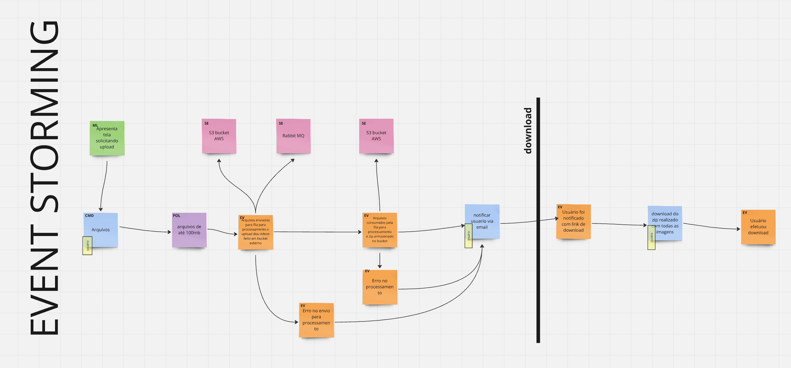
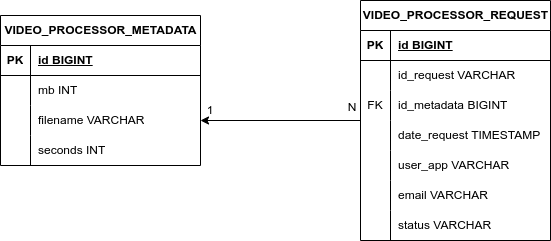
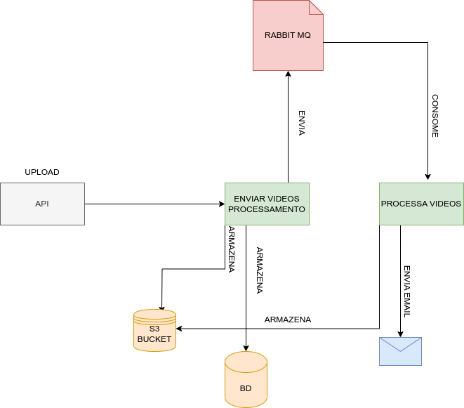

## Instruções para Subir o Projeto Localmente

### Pré-requisitos

- **Java 17**: Certifique-se de ter o JDK 17 instalado.
- **Maven**: Certifique-se de ter o Maven instalado.
- **PostgreSQL**: Banco de dados PostgreSQL configurado e em execução.
- **FFmpeg**: Instale o FFmpeg e suas dependências.

### Passos para Instalação

1. **Clone o repositório:**
   ```sh
   git clone https://github.com/pos-fiap-schepis/hackton-spring-app.git
   ```

2. **Configure o Banco de Dados:**
   - Crie um banco de dados PostgreSQL.
   - Atualize as configurações de conexão no arquivo `application.properties` ou `application.yml` com as credenciais do seu banco de dados.

3. **Instale o FFmpeg:**
   ```sh
   sudo apt-get update
   sudo apt-get install ffmpeg libavutil-dev libavcodec-dev libavformat-dev
   ```

4. **Compile e instale as dependências do projeto:**
   ```sh
   mvn clean install
   ```

5. **Execute o projeto:**
   ```sh
   mvn spring-boot:run
   ```
6. **Suba as dependências:**
   - docker compose up -d

### Configurações Adicionais

- **Configuração do Keycloak**: Certifique-se de que o Keycloak está configurado corretamente e as credenciais estão atualizadas no arquivo de configuração do Spring Boot.
- **Configuração do Minio**: Verifique as configurações do Minio no arquivo de configuração do Spring Boot.

## 📄 Documentação

Para informações detalhadas sobre as ferramentas, configurações e padrões utilizados neste template, consulte o documento abaixo:

- [README_Padroes_Ferramentas.md](docs/README_Padroes_Ferramentas.md)

Este documento inclui informações sobre:
- **Lefthook**: Configuração e uso dos hooks do Git.
- **Conventional Commits**: Padrões para mensagens de commit.
- **Changelog**: Como os changelogs são gerados e mantidos.

---

## 💡 Observações
- Este repositório é um ponto de partida. Sinta-se à vontade para modificá-lo conforme as necessidades do seu projeto.
- Garanta que todos os membros da equipe que trabalharão no projeto estejam familiarizados com as práticas e ferramentas descritas na documentação.

---

## Event Storming


## Modelagem Entidade Relacionamento


## Modelagem de desenvolvimento



Feliz codificação! 🚀